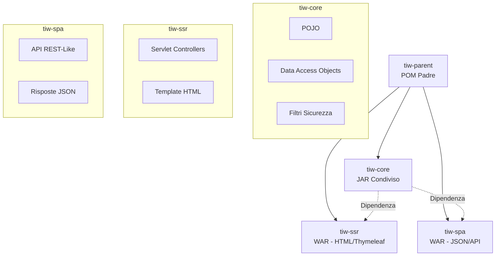
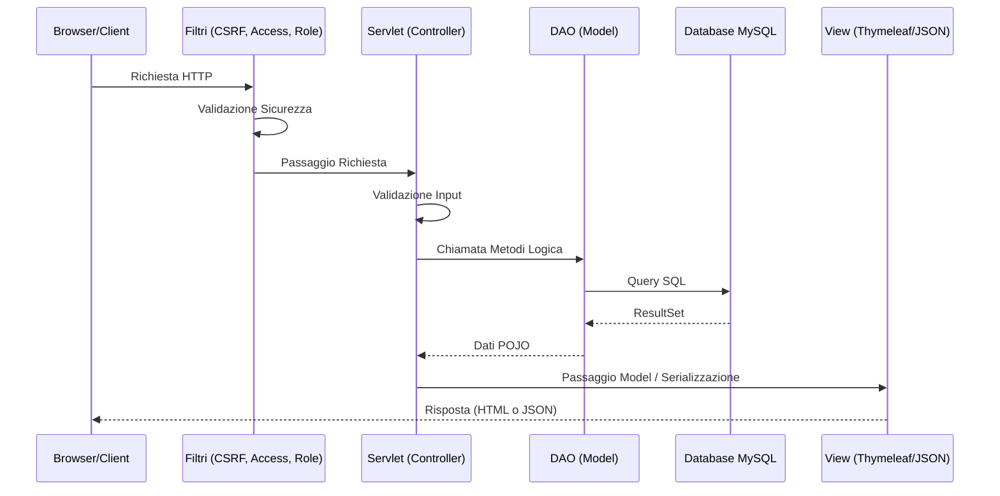
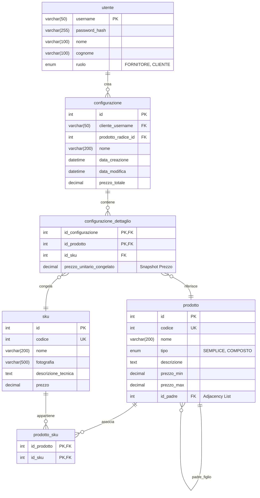

# Schema Architetturale - TIW Configuratore di Prodotto

Questo documento descrive in modo schematico l'architettura tecnica dell'applicazione TIW Configuratore di Prodotto.

## 1. Struttura del Progetto (Maven Multi-Module)

Il progetto segue un'architettura modulare suddivisa in core condiviso e due layer di presentazione distinti (Server-Side Rendering e Single Page Application).

## 2. Architettura MVC e Flusso dei Dati

L'applicazione segue rigorosamente il pattern MVC tramite Servlet, garantendo una forte separazione tra logica di business, accesso ai dati e presentazione.

## 3. Schema del Database

Il database è diviso concettualmente in due aree: Master Data (Catalogo) e Dati Transazionali (Configurazioni). È implementato usando la Single Table Inheritance per i prodotti e l'Adjacency List per la gerarchia, oltre a snapshot del prezzo per i dettagli della configurazione.

## 4. Stack Tecnologico

- **Database:** MySQL 8+ / MariaDB 10.5+
- **Backend:** Java 17, Jakarta Servlet API 6.0
- **Server:** Apache Tomcat 10.1
- **Presentazione (SSR):** Thymeleaf 3.1.2
- **Dati JSON (SPA):** Jackson 2.17.0
- **Sicurezza:** Filtri Custom (AccessControl, RoleControl, CSRF) + BCrypt (jbcrypt) per l'hashing password.
- **Build Tool:** Maven (Multi-Module)
